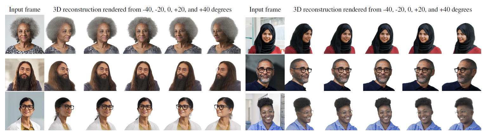

# VoluMe - Authentic 3D Video Calls from Live Gaussian Splat Prediction



## Abstract

Virtual 3D meetings offer the potential to enhance copresence, increase engagement and thus improve effectiveness of remote meetings compared to standard 2D video calls. However, representing people in 3D meetings remains a challenge; existing solutions achieve high quality by using complex hardware, making use of fixed appearance via enrolment, or by inverting a pre-trained generative model. These approaches lead to constraints that are unwelcome and ill-fitting for videoconferencing applications.

We present the first method to predict 3D Gaussian reconstructions in real time from a single 2D webcam feed, where the 3D representation is not only live and realistic, but also authentic to the input video. By conditioning the 3D representation on each video frame independently, our reconstruction faithfully recreates the input video from the captured viewpoint (a property we call authenticity), while generalizing realistically to novel viewpoints. Additionally, we introduce a stability loss to obtain reconstructions that are temporally stable on video sequences.

We show that our method delivers state-of-the-art accuracy in visual quality and stability metrics compared to existing methods, and demonstrate our approach in live one-to-one 3D meetings using only a standard 2D camera and display. This demonstrates that our approach can allow anyone to communicate volumetrically, via a method for 3D videoconferencing that is not only highly accessible, but also realistic and authentic.

## Links

* [Project Page](https://aka.ms/VoluMe)
* [Arxiv](https://arxiv.org/abs/2507.21311)
* [Video](https://www.youtube.com/watch?v=xgh46cf4_fw)

## BibTeX

```bibtex
@misc{delagorce2025volume,
    title={{VoluMe} -- Authentic 3D Video Calls from Live Gaussian Splat Prediction},
    author={Martin de La Gorce and Charlie Hewitt and Tibor Takacs and Robert Gerdisch and Zafiirah Hosenie and Givi Meishvili and Marek Kowalski and Thomas J. Cashman and Antonio Criminisi},
    year={2025},
    eprint={2507.21311},
    archivePrefix={arXiv},
    primaryClass={cs.CV},
    url={https://arxiv.org/abs/2507.21311},
}
```
